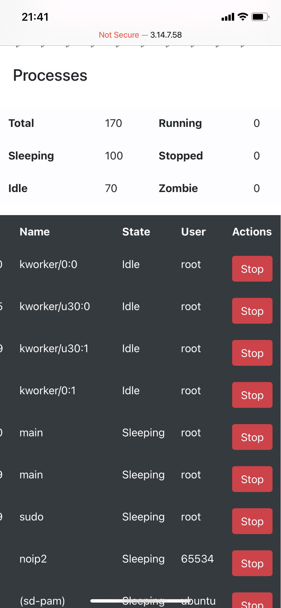

# Manual de Usuario Practica 1 Sistemas Operativos 2

Diciembre 2020

### Aplicacion Web

Para acceder a la aplicacion web debe hacerlo a travez de ls siguiente direccion

    http://3.14.7.58

### Validacion de credenciales de usuario.

Al acceder obtendra acceso a las metricas del sistema en tiempo real, pero para ello primero debe proporcionar las credenciales de acceso

    admin:admin

Para usuario y contraseña respectivamente como se muestra a continuacion.

Cuando las credenciales son incorrectas se notificara el error.

### Aplicacion Web

Una vez dentro del dashboard de la aplicación, vera la grafica que muestra en tiempo real el uso del sistema, el total de la ram disponible, el total de la ram utilizada en mb asi como en porcentaje, tambien el total de cpu utilizado en porcentaje.

### Administracion de procesos

La aplicacion muestra en el modulo de procesos el total de procesos en ejecucion, el total de procesos en estado "sleeping" el total de procesos en ejecucion, el total de procesos "idle" y tambien el total de procesos Zombie en el sistema.

Por ultimo una lista de cada uno de estos procesos con una accion que nos permitira terminar con la ejecucion de un proceso especifico, la accion lleva por nombre "STOP".
